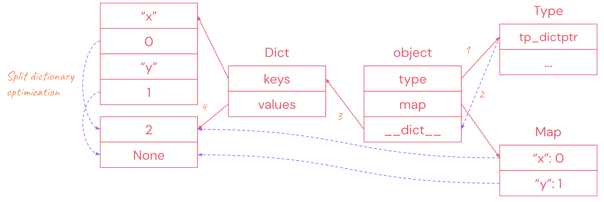
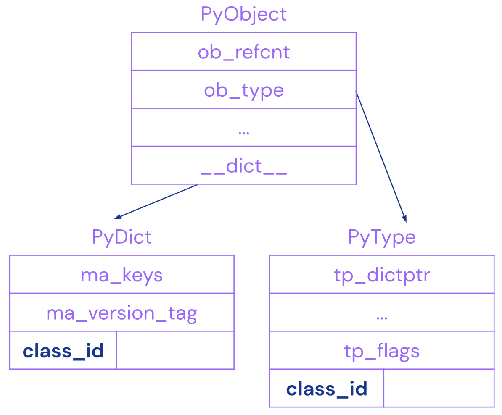

# S6: A standalone JIT compiler library for CPython

S6 was a project that started within DeepMind in 2019 to accelerate CPython with
just-in-time compilation (“JIT”). These features would be provided as a regular
Python library, and no changes to the CPython interpreter itself would be
necessary. S6 was aiming to do for Python what V8 did for Javascript (the name
is an [homage](https://en.wikipedia.org/wiki/Straight-six_engine) to V8).
Work was based on CPython verison 3.7. Depending on the workload, we saw
speedups as high as 9.5x on common benchmarks.

```py
import s6

@s6.jit
def foo(x):
  return x + 1
```

## Project goals

Python is slow, and a lot of researchers use Python as their primary interface
to build models. This can create friction for researchers, and speeding up the
model building process can improve iteration and development time. The
[network effect](https://en.wikipedia.org/wiki/Network_effect) of Python has
made moving to a different language very difficult. So with Python here to stay,
we looked to improve upon it.

The requirements we set ourselves were:

-   Increase the speed of common programs x-fold: not 10%, but 10x.
-   Be fully compatible with CPython. Most tools, libraries, and infrastructure
    that researchers use only work with CPython.
-   Not require any code changes. Users should be able to import S6, wrap their
    top level function in a JIT annotation, and that’s it.

## Status and support

We have stopped working on S6 internally. As such, this repository has been
archived and we are not accepting pull requests or issues. We open-sourced the
code and provided a design overview below to spur conversations within the
Python community and inspire future work on improving Python.

## Setting it up locally

We set up a Docker container and some Jupyter notebooks to allow you to build
and experiment with S6. To do so, follow these steps.

Set up the S6 Docker container:

1.  [Install docker](https://docs.docker.com/get-started/#download-and-install-docker).

2.  Build the S6 docker container:

    ```shell
    docker build -t deepmind-s6:latest .
    ```

You can run the docker container in two different ways:

1.  By running a notebook server:

    ```shell
    docker run -p 8888:8888 deepmind-s6:latest jupyter lab --port 8888 --ip 0.0.0.0 --no-browser --allow-root --NotebookApp.token=SECRET_TOKEN
    ```

    Then open `localhost:8888/lab?token=SECRET_TOKEN` in a web browser.

    Demo [notebooks](src/notebooks/hello_world.ipynb) are found in the
    `notebooks` directory.

2.  By running an interactive shell session:

    ```shell
    docker run -it deepmind-s6:latest /bin/bash
    ```

    The test suite for S6 can be run from within a Docker shell session with:

    ```shell
    (cd /open-s6/s6/build; ninja test)
    ```

## Benchmark results

Overall, S6 provides a speed of up to 10x over CPython for pure Python
benchmarks. Workloads that heavily rely on C APIs, like those that use NumPy,
are bottlenecked by the C API calltime. Future work could include targeted
optimisations in the C code to improve this; for example, use the profiling
metadata to skip all the type checks normally done by C APIs.

Most testing during development was against internal benchmarks, or private
variants of external benchmarks. Here we report results on three public
[pyperformance](https://github.com/python/pyperformance) benchmarks; their
docstrings detail minor modifications.

### Richards

[Richards](https://github.com/python/pyperformance/blob/main/pyperformance/data-files/benchmarks/bm_richards/run_benchmark.py)
is a common benchmark that best represents pure Python code that researchers
write. For the Richards benchmark located under the benchmarks directory, if you
run with 100 iterations, depending on your hardware, you should see a 7x speedup
over the default Python 3.7 interpreter.

-   On our internal dev machines, we saw speedups of 9.5x on average.

### Raytrace

[Raytrace](https://github.com/python/pyperformance/blob/main/pyperformance/data-files/benchmarks/bm_raytrace/run_benchmark.py)
is a pure-Python mathematical benchmark.

-   On our internal dev machines, we saw speedups of 3-4.5x on average.

### Unpack Sequence

[Unpack sequence](https://github.com/python/pyperformance/blob/main/pyperformance/data-files/benchmarks/bm_unpack_sequence/run_benchmark.py)
is the worst performing benchmark we ran on S6. The cause is that S6 has its own
`ceval.c` interpreter that is not as well optimized as the standard CPython one.
We had to write a separate `ceval.c`-like interpreter in order to add hooks for
S6 to compile functions and collect type feedback. With the standard unpack
sequence benchmark you can see a 5x slowdown as the main `do_unpacking` function
is called once and with that one call, we use our own, slower interpreter.

Even then, `UNPACK_SEQUENCE` is a difficult bytecode to handle from a type
checking perspective. Even if the input to the function is an array/tuple, an
array/tuple can contain any different type and in different orderings. So we
need to type check every element to make sure that the JIT'd function is being
passed the correct input types. Because of all this type checking, if a function
either unpacks a giant array/tuple or does a lot of unpacking (like the
benchmark), our compiled code can end up being slower than interpreted CPython.
As such, if we detect there are many or a large unpack, we avoid compiling the
function and bail out to the optimized `ceval.c` interpreter in CPython
everytime we come back to this function.

With the issues of `UNPACK_SEQUENCE` in mind, we included two version of the
unpack sequence benchmark. The super slow one (0.2x speedup) is where the
for-loop is in `do_unpacking` so we never bail out to `ceval.c` and then a
faster one (0.97x speedup) where we took the for-loop out of `do_unpacking` and
instead call `do_unpacking` `loops` number of times.

## Known limitations

S6 exists as a standalone dependency and does not require any *code* changes in
CPython. However, it was developed for an environment with two unusual features:

1.  Native code needs to store a frame pointer, which typically requires the
    `-fno-omit-frame-pointer` compiler flag when building CPython and native
    extensions. Without this change, jit compilation might crash in some cases.
2.  In the CPython interpreter, the function `PyFrame_FastToLocalsWithError`
    needs to be intercepted by S6. We used to do this by linking Python and
    Python extensions with the linker flag
    `--wrap=PyFrame_FastToLocalsWithError`, but this is not part of the current
    release, and jit compilation might misbehave in some cases.

As discussed in the [unpack_sequence](#unpack-sequence) benchmark section, S6
does not run well on giant functions. To mitigate this, break up your function
into smaller pieces.

S6 only supports CPython 3.7, but with some changes it could be made to support
later CPython versions.

There is further work to be done optimising S6's strongjit. Further performance
improvements would be expected from additional compiler optimisations, such as
inlining.

## Design

S6 replaces the existing CPython interpreter/bytecode handler
[`ceval.c`](https://github.com/python/cpython/blob/3.7/Python/ceval.c) with our
own `interpreter.cc`. For every `PyCodeObject`, S6 does the following:

-   Check to see if the function has already been compiled; if the code has, S6
    looks up and runs the compiled code.

-   If the code is not compiled, S6 runs the S6 bytecode interpreter, which is
    very similar to the CPython interpreter.

Similarly to V8, we maintain a counter that counts how many interpreter
instructions have been executed. When this reaches a threshold, the PyCodeObject
at the top of the call stack is considered for compilation.

To determine what code to compile, we use the Oracle which asynchronously
compiles the function after a certain number of bytecode instructions and
function visits. When compiling code, S6 translates it to *strongjit*: an
intermediate representation suitable for various optimization passes. CPython
bytecode implementations can be complex, and translation may create many
strongjit instructions per Python bytecode.

Given type feedback, we may choose to make assumptions about inputs to a
function in order to generate optimisation opportunities (for instance that an
input is always an integer). We refer to this as function specialization. Guards
are put in place to check that these assumptions hold. If they do not, then the
function must be de-optimized and the bytecode is interpreted as before. Because
checking the type of all arguments at every function call may be costly, and to
avoid producing huge numbers of specializations, we only specialize on the
common case of the type of the first argument (usually `self`).

When deoptimizing, we convert the optimized function state into CPython state
(PyFrameObject) and continue with the normal interpreter. However in many cases
we are not at a bytecode boundary when we deoptimize. In this case we interpret
the strongjit IR until we get to a boundary point. After writing and optimizing
the strongjit IR, S6 lowers it to x86 machine code using the `asmjit` library.

### Hidden classes

In its initial design, S6 used inline caching keyed on an object’s *Map*. A Map
comes from prototype-based languages (introduced in
[SELF](https://link.springer.com/chapter/10.1007/BFb0057013)). It is also termed
a *Shape* (in V8). It attempts to describe the location of attributes within an
object. All objects with the same Map have the same attributes in the same
locations. An *inline cache* memoizes the last result of an operation based on
the Map of the input.

Frequently we used the Map as a cache key, as any modification to the behavior
of an object should result in a *Map transition* (Maps are immutable).

For example, if we have the following in Python:

```py
c.x
```

The pseudo code of lookup would look like this:

```py
if map(c) == M:
  return c.__attributes__[0]
else:
  return __getattr__(c, "x")
```

Or for example, as shown in the diagram below, to get the `x` attribute we:

1.  Obtain the `tp_dictptr` field from the object’s type.
2.  Use the `tp_dictptr` to get the `__dict__` field’s address from the object.
3.  Follow the `__dict__` to get the `PyDictObject` itself.
4.  Look at the `values` array. The `Map` from step 2 tells you how to map from
    key to value.

*(below, the red arrows are direct pointers, while purple arrows are indirect
using the offset int value)*



However, there are at least three issues with this approach:

In almost all instances **a cache keyed on a `Map` is insufficient**, as
Python’s type system allows modifications to an object’s `Type` to modify
attribute lookup on the object, even if the object has overridden a given
attribute already. The example of this is data descriptors. A modification to a
`Type` potentially invalidates all associated `Map`s. A `Map` could be
specialized on the *type version* of its type, but this loses all the benefits
of structural typing. So when we should have a monomorphic cache lookup since
two types look the same (duck typing), we still require a polymorphic lookup.

```py
class C(object):
  def __init__(self):
    self.x = 2
class D(object):
  def __init__(self):
    self.x = 3
def f(a : Union[C or D]):
  return a.x  # Structurally monomorphic, nominally polymorphic.
```

**Inline caches reference mutable data**. This can be a problem when dealing
with functions. Holding borrowed references to function objects is unsafe, and
acquiring references to function objects can be costly.

```py
def f(l, a):
  def g(x): ...
  for x in l:
    a += g(x) # inline cache holds reference to "g". Unsafe if borrowed, costly
              # if increffed every time, and changes the lifetime of any object
              # captured by `g`.
  return a
```

We needed to **add an extra field to `PyObject`** to store the map pointer, but
this would have broken ABI guarantees and made the possibility of upstreaming S6
into CPython very challenging.

So instead we implemented hidden classes. Hidden classes are a parallel type
system to Python’s types. They are a subcategorization of types - objects of a
unique type may have different hidden classes, but objects of a unique hidden
class always have the same type. In this way they are distinct from *Maps* or
*Shapes* that provide uniqueness based only on structural typing.

Hidden classes provide:

-   Behavioral stability; if an object’s hidden class has not changed, its
    behavior has not changed.
-   A dense numbering; for efficient lookup in a global dispatch table.
-   A compile-time-inspectable enumeration of members and methods.
-   Type information about member variables and methods.
-   Type information is provided as a lattice in which information becomes
    weaker but never stronger.

Given that hidden classes contain a lattice of type information, they are not
immutable, but they do change in well-defined and observable ways.

CPython never uses hidden classes. They are invisible to CPython and no type
queries, subclass queries will never return different information based on
hidden classes.

#### Obtaining a class from a PyObject

We must be able to store a mapping between PyObjects and hidden classes. The
mapping must be incredibly fast.

One of the goals of S6 is to be import-compatible with existing CPython.
Modifications to the PyObject class were not allowed, and as PyObject only
contains two members (ob_refcnt and ob_type), there is nowhere to hide a class
ID. Instead, we hide the hidden class ID inside PyDictObjects and PyTypeObjects.

We observe that there are two categories of object - objects that behave the
same as a newly created object of their type, and those that behave differently.

```py
class A(object): pass
a = A()
b = A()  # a and b behave the same, and are of the same type, so same class ID.
b.x = 2  # Now b behaves differently from A, they must have differing class IDs.
```

For objects that behave the same a a newly created object of the same type, we
can store the class ID in the type object.

For objects that behave differently: in order to behave differently they must
have a `__dict__`. This is the only means of changing behaviour. Therefore we
can store the class ID in the PyDictObject used as `__dict__`.

Specifically: Class identifiers are dense integers <= 20 bits in size.

If the PyObject has a `__dict__`, the class identifier uses the uppermost 20
bits of the `dict`’s `ma_version_tag` field.

Otherwise the class identifier uses the uppermost 20 bits of `PyTypeObject`’s
`tp_flags` field. This field is 64-bits long and is already zeroed.



This has implications:

-   We don’t support hidden classes for objects with custom attribute getters or
    setters, because modifications to an object’s attributes require a `dict`
    for us to store the class ID.
-   If an object’s `dict` is modified outside the visibility of S6, a new
    `ma_version_tag` will be set by CPython. This will have the upper 20 bits
    zeroed, setting the effective class ID to 0. This allowed us to notice if
    our assumptions have been broken behind our back. Note that wrap-around for
    the other 44 bits would take 5 years if dicts were modified at 100kHz.
-   We don’t support objects with `tp_dictoffset < 0`. This means the `dict` is
    offset from the end of the object in memory, which is a more complex
    calculation. This is rare and only really used for `str` or `long`
    subclasses.

The ability to store class IDs inside the `PyTypeObject` allows us to store a
hidden class for all objects even if they do not have a `dict`. An example of
this is builtin types, which are generally immutable. Objects that have custom
attribute setters are still excluded however, because tracking whether an object
still has the behaviors of its base type or not is impossible.

#### Behavioral changes

There are two classes of behavioral change: modifications to the type or a
supertype and modifications to an object.

##### Type modification

Modification of a type potentially changes the behavior of all hidden classes
indirectly derived from that type. Therefore, in order to use a hidden class
with a type, we must ensure that we can detect all behavioral changes of the
type and its supertypes.

This is achieved by wrapping the modifiable members of the type and all its
supertypes (`tp_setattro`, `__bases__`, `__class__`) with a wrapper function
that informs S6. If the type has a custom `setattro`, we do not optimize the
type.

When a type is modified, the world is stopped (easy because of the GIL),
compilations are halted, all affected classes are modified and if any attribute
of a class was changed that generated code relied upon, the generated code is
thrown away.

##### Object modification

If an attribute is added or deleted from an object, the object must take a class
transition and have a new class. This is so that all attribute loads and stores
can load and store without `nullptr` or out of bounds guards.

If an existing attribute is *modified*, then it is possible the behavior of an
object changes. Examples include modifying a method. The method table for the
object is then incorrect; the object must undergo a class transition. Attributes
for which modification *requires* a class transition are marked as ‘behavioral’.

```py
class C(object):
  def f(self): pass

a = C()  # Has hidden class H
a.x = 2  # New hidden class, H -> H2 because new attribute `x`.
a.x = 3  # Same class H2 - attribute merely changed.
a.f = 4  # New hidden class, H2 -> H3, because `f` was a member function before
         # and thus was marked "behavioral".
```

##### Cacheable attributes

Attributes that do not change value across all object instances of a class are
termed ‘cacheable’. These attributes have a stable value and the code generator
may emit code that relies upon this value being stable. Simple cases include a
boolean attribute. An attribute-write to an attribute that is currently marked
‘cacheable’ to a different value simply removes the ‘cacheable’ flag and any
code generated that relied on the attribute is thrown away.

#### Globals

Python code contains a large number of lookups to the `__globals__` dict. Even a
function call requires consulting the globals dict to obtain the
`PyFunctionObject` for a symbol name.

We can consider this dict in the same way as we treat object `__dict__` fields;
we store a class ID in the globals dict, and can use all of the fast attribute
tricks implemented for objects on global values.

In particular, the `cacheable` property described above implicitly allows us to
optimize away code hidden behind global booleans that are never modified:

```py
DEBUG_MODE = False  # Set this to True to enable debug statements.

def f(a):
  if DEBUG_MODE:  # This is a load of globals.DEBUG_MODE, which is known to be
    print(a)      # always False at runtime.
  return a + 1
```

#### Adoption of new types and objects

*Adoption* of a type or object is where S6 determines the correct hidden class
and sets it. Adoption of an object involves ensuring that its type is adopted
and setting its hidden class. This may involve inspecting the dictionary to see
which attributes have already been set. Adoption of a type involves creating a
new hidden class, setting the `Py_TPFLAGS_S6_Adopted` flag and overriding
`tp_new` to a wrapper function that allows us to adopt all new instances of the
object.

When S6 is initialized, we eagerly scan the type hierarchy to adopt all types.
We override `PyTypeObject::tp_new` to a wrapper that lets us detect and adopt
newly created types.

This should allow us to catch all new instances of all objects except some
extension objects (Extension types that call `Py_Ready()` for the first time
*after* we have greedily scanned the type hierarchy). These will be small in
number and we can add mitigations if needed (like adopting in tactical places
like `GetAttr`).

### Oracle

The `Oracle` class determines which functions are worth compiling and manages
the compilation queue. For development/debugging, you can configure whether
functions should be compiled asynchronously/synchronously, how often functions
are profiled and compiled, and more.

Compilation in the Oracle is a two step process. We don’t immediately compile
the function we first step into. Every `profile_bytecode_instructions_interval`
instructions, the current `PyCodeObject` is inspected and `hotness_threshold`
decremented; if `hotness_threshold` reaches zero, the object will be optimized.
This two-stage process reduces the frequency of accessing code metadata.

### Arithmetic Unboxing

Since `bool`s/`float`s/`long`s in Python are all objects, they are boxed types.
Doing arithmetic operations on these boxed types can be very expensive compared
to a single assembly instruction on values in registers. And since we collect
type information, we can unbox the values from the CPython boxed types to do
much faster arithmetic operations. Refer to `UnboxInst` and `BoxInst` for more
information.

## API

### `@s6.jit`

Decorator to mark the function as JITable to S6. When the callable is invoked,
just-in-time compilation mode is enabled if it was not enabled already. All
functions called transitively by the decorated function are considered for
just-in-time compilation, but only one function is compiled at a time. Note that
a function in the call stack is not necessarily compiled on the first call, but
only after some number of calls. See the Oracle section for more details.

### Developer APIs

A number of internal APIs are exposed by calling `s6.inspect(foo)` for any
function `foo` that is decorated with `@s6.jit` or have been marked for tracing
if the decorated function called the function. These are completely unnecessary
during normal operation, and are made accessible for users to inspect and
introspect the JIT process.

#### `strongjit`

Returns a string version of the intermediate representation used by S6 of `fn`,
which is named “strongjit”. The version returned here is the version after
optimizations before it is compiled to machine code. The strongjit can be
interpreted by using the `_evaluate` method of the s6.jit object.

#### `is_compiled`

Returns `True` if `fn` is currently compiled, and `False` otherwise.

#### `force_compile()`

Compiles `fn`, if it has not already been compiled. Throws an exception if the
compilation fails.

#### `deoptimize()`

Deoptimize `fn`. This only deoptimizes the main specialization. Throws
`NotCompiledError` if not compiled

#### `_evaluate(...)`

Evaluates `fn` with the S6 evaluator. "Evaluating" means interpreting the S6
strongjit of `fn`.

The function `fn` needs to be compiled, otherwise execution will fall back to
using the CPython interpreter and compilation will never be triggered. This
function has no purpose other than debugging. If calling a compiled function
with `_evaluate` doesn't result in the same behavior as when calling it will the
normal call (of a jitted function), then S6 code generation has a bug.

This will apply to all functions called by `fn` recursively except if another
explicit call to the S6 API changes it. If a called function wasn't compiled,
execution will revert to using the plain CPython interpreter.

## Strongjit IR

Strongjit is a static single-assignment form intermediate representation (SSA
IR) that uses block arguments instead of PHI instructions for control flow. To
produce optimized code, Python bytecode is translated to strongjit. Successive
optimisation passes improve the strongjit. The improved strongjit is then
translated to assembly. The design goals of the IR were:

-   Textually round-trippable for testing.
-   Compact, cache efficient. This is a JIT compiler, and we manipulate existing
    instructions/ops much less than frameworks like MLIR. Strongjit is,
    however, designed to be easily translatable to MLIR.
-   Amenable to standard operations and traversals found in optimizing compilers
-   Certain operations should be cheap:
    -   Instruction insertion.
    -   Instruction deletion.
    -   Block insertion, deletion, splitting.
    -   RPO traversal.
    -   Traversing def-use chains (at least from use to def; traversing from a
        def to all uses is less common).
    -   Holding a handle to an instruction that is invariant to instruction
        insertion/deletion.

### Blocks and Instructions

-   `Value`s are the base of the hierarchy. Basic blocks, instructions and block
    arguments are all values. They can use other `Value`s and be used in turn.
    `Value`s have an operand list.

-   `Instruction`s are `Value`s that reside inside a `Block`. Their address is
    constant and is never reused.

-   `Block`s are `Value`s. `Instruction`s can refer to `Block`s as operands, for
    example `jmp &0`. `Block`s contain a doubly linked list of `Instruction`s.
    `Block`s do not own the storage for `Instruction`s - this is owned by
    `Function`.

-   `Function`s are the outermost unit of the hierarchy. They maintain a list of
    `Block`s and own the storage for all `Block`s and `Instruction`s. The list
    of `Block`s is again a doubly linked list.

-   `Offset`: a bytecode instruction offsets. Gives a location within
    interpreted code. Used for exception/tracing location information and for
    deoptimization out of generated code.

For cache locality, all instructions reside in a single deque-like container
that uses tombstones when instructions are erased to keep all instruction
addresses constant. This allows pointers to instructions to be stored.

There is a lightweight class hierarchy that uses the instruction opcode as a
discriminator (See: `casts`) and allows rich, type safe accessors/mutators.

### Instructions

See implementation in [`instructions.h`](src/strongjit/instructions.h).

-   `ConstantInst`: Materializes an `int64` immediate as a `Value`.

-   `JmpInst`: An unconditional jump to a single successor.

-   `BrInst`: A conditional branch to two successors.

-   `CompareInst`: Compares two operands.

-   `ExceptInst`: Unconditional jump to the exception handler.

-   `DeoptimizeIfInst`: A conditional deoptimize. The `true_successor` is a
    deoptimized block. Maintains a set of values that are required in order to
    run the deoptimized code.

-   `ReturnInst`: Unconditional return.

-   `UnreachableInst`: Terminate the current control flow arc with an error.

-   `NegateInst`: Unary arithmetic negation.

-   `NotInst`: Unary boolean `not`.

-   `AddInst`: Binary arithmetic addition.

-   `SubtractInst`: Binary arithmetic subtraction.

-   `MultiplyInst`: Binary arithmetic multiplication.

-   `DivideInst`: Binary arithmetic division.

-   `RemainderInst`: Binary arithmetic modulo operation.

-   `AndInst`: Binary boolean `and` operation.

-   `OrInst`: Binary boolean `or` operation.

-   `XorInst`: Binary boolean `xor` operation.

-   `ShiftLeftInst`: Binary shift-left operation.

-   `ShiftRightSignedInst`: Binary signed shift-right operation.

-   `IntToFloatInst`: integer to float conversion.

-   `SextInst`: Sign-extension operation.

-   `IncrefInst`: Increase reference count.

-   `DecrefInst`: Decrease reference count.

-   `LoadInst`: Loads from a pointer location with optional extension.

-   `LoadGlobalInst`: Loads a global by name, given an index into the `kNames`
    tuple. Lookup follows the Python convention, looking in the frame globals
    dict and then in builtins if not found in globals. The result is a borrowed
    reference to a `PyObject*` or `0` (with an appropriate exception set) if the
    lookup failed.

-   `StoreInst`: Stores to a pointer location with optional truncation.

-   `FrameVariableInst`: Obtains the address of a local variable. This
    instruction also takes an index `i`, used with the `kConsts`, `kNames`,
    `kFastLocals` and `kFreeVars` kinds.

-   `CallNativeInst`: Calls a C function by symbol. The callee must be in a
    known `allowlist`.

-   `RematerializeInst`: A lazily called `CallNativeInst`. It exists to allow
    eliding work on the fast path that needs to be done if we deoptimize. An
    example here is eliding an attribute load for a method call. If we are
    forced to deoptimize before the call, for example while computing arguments,
    we are forced to materialize the attribute load. A `RematerializeInst` is
    only run during deoptimization, if the de-optimizer finds a
    `RematerializeInst` in the value stack it will call the runtime function to
    materialize the true value.

-   `CallPythonInst`: Calls a Python value.

-   `CallAttributeInst`: Calls an attribute on a value. This is equivalent to
    `(call_python (call_native s6::GetAttr $x, "attr"), ...)`. The attribute is
    stored as a string inside the function's string table.

-   `CallNativeIndirectInst`: Calls a native function through a function
    pointer.

-   `SafepointInst`: A `BytecodeBeginInst`, `YieldValueInst` or a
    `DeoptimizeIfSafepointInst`. It contains a bytecode offset, value stack and
    try handler stack; enough information to construct an accurate interpreter
    frame.

-   `BytecodeBeginInst`: Marks the beginning of a bytecode instruction. This
    contains all the information required to reconstruct a CPython interpreter
    state: bytecode offset, value stack contents and try-block stack contents.

-   `YieldValueInst`: Yields within a generator function. The function's state
    is saved, and can be resumed after the yield. `YieldValueInst` takes a
    single operand that is yielded to its caller, and its result is the value
    the caller sends back. Because generators may be deoptimized while paused,
    `YieldValueInst` also holds enough information to reconstruct an interpreter
    frame (it is a `SafepointInst`).

-   `DeoptimizeIfSafepointInst`: Deoptimizes if a condition is `true` or
    optionally `false`. This instruction has enough information to materialize
    an interpreter frame (it is a `SafepointInst`), so it does not need to act
    as control flow - if deoptimization occurs then no more strongjit IR code is
    run.

-   In this way it is distinguished from `DeoptimizeIfInst`, which deoptimizes
    but is not at a `Safepoint` boundary and needs to run more strongjit code
    (in the evaluator, usually) to get to a boundary.

-   `AdvanceProfileCounterInst`: Adds amount to the profile counter. This
    indicates that approximately the amount of CPython bytecodes of work has
    been performed.

-   `IncrementEventCounterInst`: Increments a named event counter managed by the
    `EventCounters` singleton. Each event counter counts the number of times
    that it has been incremented by reaching a trace point during the execution
    of compiled code.

-   `TraceBeginInst`: Starts a trace event with a named argument in the trace
    category `TraceCategories::kFunctionExecution`. The name is stored in the
    global intern table. Deoptimization is handled implicitly. Each
    `TraceBeginInst` must be balanced by a `TraceEndInst`. This means that a
    `TraceBeginInst` inserted at the beginning of a function must be balanced by
    a `TraceEndInst` at all exit points, which include:

    -   `ReturnInst`
    -   `ExceptInst`, where the instruction has no successors.
    -   `YieldInst`, with a matching `TraceBeginInst` after the `YieldInst` to
        resume the event.

-   `TraceEndInst`: Ends a trace event with a named argument in the trace
    category `TraceCategories::kFunctionExecution`. The trace event must have
    been started by a corresponding `TraceBeginInst`.

-   `BoxInst`: Constructs a Python `Long`/`Float`/`Boolean` from the operand.

-   `UnboxInst`: Extracts a native `Long`/`Float`/`Boolean` from a Python
    object. If the object is not of the correct type (e.g. `PyFloat` where
    `PyLong` is expected) or, in the case of `PyLong`, its value exceeds 64
    bits, then the `overflow` flag is set. This can be detected using
    `overflowed?` as the very next instruction.

-   `OverflowedInst`: Determines whether the operand overflowed. The operand
    must be an arithmetic or unbox instruction, and must occur immediately
    before this instruction in the same block.

-   `FloatZeroInst`: Determines whether the operand is floating point zero,
    either positive or negative.

-   `GetClassIdInst`: Given an object, returns its class ID.

-   `GetObjectDictInst`: Given an object, returns its dict or zero on failure.

    -   If the `dictoffset` or type are known, this instruction can operate more
        efficiently.

-   `GetInstanceClassIdInst`: Given an object's `__dict__`, returns its class
    ID.

-   `CheckClassIdInst`: Checks if an object has a particular class ID.

-   `LoadFromDictInst`: Given an object's `__dict__`, loads
    `__dict__.ma_values[index]`.

-   `StoreToDictInst`: Given an object's `__dict__`, stores to
    `__dict__.ma_values[index]` and returns the value replaced.

-   `CallVectorcallInst`: Calls a native function with CPython's vectorcall
    calling convention.

-   `SetObjectClassInst`: Sets the class ID of an object. The object and its
    instance dictionary are passed, and the `ma_version_tag` of the instance
    dictionary is written.
